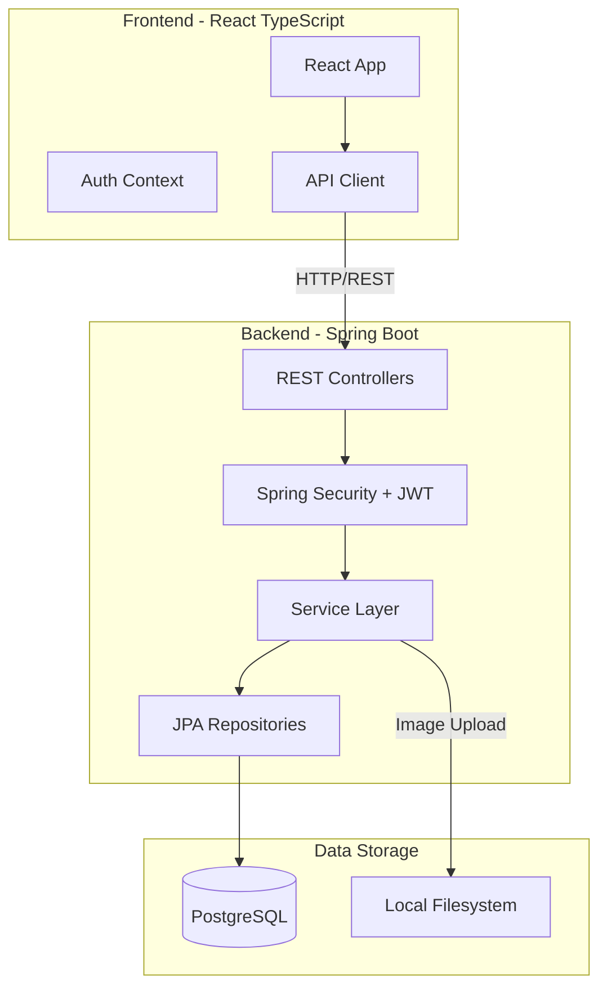
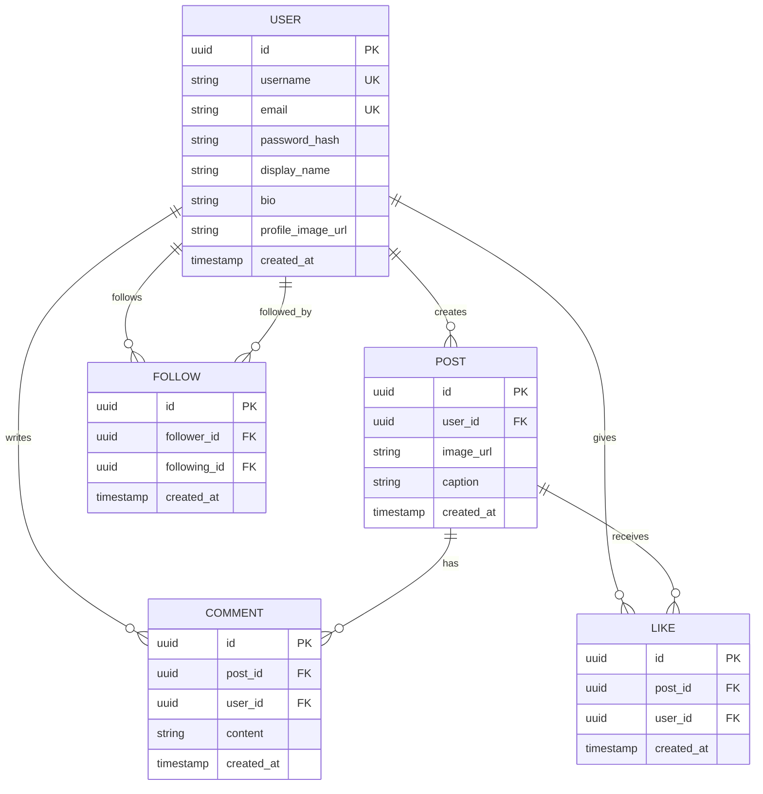

# PunchCard - Bread Instagram Clone Development Plan

## Architecture Overview




## Data Model



---

## Phase 1: Project Setup and Infrastructure

### 1.1 Backend Setup (Spring Boot)

Create the Spring Boot project structure at [`src/backend/`](src/backend/):

```javascript
src/backend/
├── pom.xml
├── Dockerfile
├── src/
│   ├── main/
│   │   ├── java/com/punchcard/
│   │   │   ├── PunchCardApplication.java
│   │   │   ├── config/
│   │   │   ├── controller/
│   │   │   ├── service/
│   │   │   ├── repository/
│   │   │   ├── model/
│   │   │   ├── dto/
│   │   │   ├── exception/
│   │   │   └── security/
│   │   └── resources/
│   │       ├── application.yml
│   │       └── application-test.yml
│   └── test/
│       └── java/com/punchcard/
```

**Key Dependencies (pom.xml):**

- Spring Boot Starter Web
- Spring Boot Starter Data JPA
- Spring Boot Starter Security
- Spring Boot Starter Validation
- PostgreSQL Driver
- Lombok
- jjwt (JWT library)
- Spring Boot Starter Test
- Testcontainers (for integration tests)

### 1.2 Frontend Setup (React TypeScript)

Create the React project at [`src/frontend/`](src/frontend/):

```javascript
src/frontend/
├── package.json
├── tsconfig.json
├── Dockerfile
├── src/
│   ├── components/
│   ├── pages/
│   ├── hooks/
│   ├── context/
│   ├── services/
│   ├── types/
│   └── App.tsx
```

**Key Dependencies:**

- React 18 + TypeScript
- React Router DOM
- Axios (API client)
- React Query (server state management)
- Tailwind CSS (styling)

### 1.3 Docker Configuration

Create [`docker-compose.yml`](docker-compose.yml) at project root:

- PostgreSQL container (port 5432)
- Backend container (port 8080)
- Frontend container (port 3000)
- Shared network
- Volume for PostgreSQL data persistence
- Volume for uploaded images

---

## Phase 2: Authentication and User Management (TDD)

### 2.1 Backend - User Entity and Repository

**Test First Approach:**

1. Write `UserRepositoryTest` - test user CRUD operations
2. Implement `User` entity with JPA annotations
3. Implement `UserRepository` extending JpaRepository

### 2.2 Backend - Authentication Service

**Test First Approach:**

1. Write `AuthServiceTest`:

- `testRegisterUser_Success`
- `testRegisterUser_DuplicateEmail_ThrowsException`
- `testLogin_ValidCredentials_ReturnsToken`
- `testLogin_InvalidCredentials_ThrowsException`

2. Implement:

- `AuthService` - registration and login logic
- `JwtService` - token generation and validation
- `SecurityConfig` - Spring Security configuration
- Password encoding with BCrypt

### 2.3 Backend - Auth Controller

**Test First Approach:**

1. Write `AuthControllerTest` using MockMvc:

- `POST /api/auth/register`
- `POST /api/auth/login`
- `GET /api/auth/me` (get current user)

2. Implement `AuthController` with proper DTOs:

- `RegisterRequest`, `LoginRequest`, `AuthResponse`

### 2.4 Frontend - Auth Implementation

- Create `AuthContext` for managing auth state
- Build login and registration pages
- Implement JWT token storage and automatic header injection
- Add protected route wrapper component

---

## Phase 3: Photo Upload and Feed

### 3.1 Backend - Post Entity and Image Upload

**Test First Approach:**

1. Write `PostRepositoryTest`
2. Write `ImageStorageServiceTest`:

- `testUploadImage_ValidFile_ReturnsUrl`
- `testUploadImage_InvalidType_ThrowsException`

3. Implement:

- `Post` entity
- `PostRepository`
- `ImageStorageService` - save images to local filesystem
- Configure static resource serving for uploaded images

### 3.2 Backend - Post Service and Controller

**Test First Approach:**

1. Write `PostServiceTest`:

- `testCreatePost_WithImage_Success`
- `testGetFeed_ReturnsPaginatedPosts`
- `testGetPostById_Exists_ReturnsPost`
- `testDeletePost_ByOwner_Success`

2. Write `PostControllerTest`:

- `POST /api/posts` (multipart with image)
- `GET /api/posts` (paginated feed)
- `GET /api/posts/{id}`
- `DELETE /api/posts/{id}`

3. Implement `PostService` and `PostController`

### 3.3 Frontend - Feed Implementation

- Build image upload component with preview
- Create post card component
- Implement infinite scroll feed
- Add create post modal/page

---

## Phase 4: Social Features (Follow System)

### 4.1 Backend - Follow System

**Test First Approach:**

1. Write `FollowRepositoryTest`
2. Write `FollowServiceTest`:

- `testFollowUser_Success`
- `testUnfollowUser_Success`
- `testGetFollowers_ReturnsList`
- `testGetFollowing_ReturnsList`
- `testFollowSelf_ThrowsException`

3. Write `FollowControllerTest`:

- `POST /api/users/{id}/follow`
- `DELETE /api/users/{id}/follow`
- `GET /api/users/{id}/followers`
- `GET /api/users/{id}/following`

4. Implement `Follow` entity, repository, service, and controller

### 4.2 Backend - User Profile

**Test First Approach:**

1. Write `UserServiceTest`:

- `testGetUserProfile_ReturnsProfileWithStats`
- `testUpdateProfile_Success`

2. Write `UserControllerTest`:

- `GET /api/users/{username}`
- `PUT /api/users/me`

3. Implement `UserService` and `UserController`

### 4.3 Frontend - Profile and Follow

- Build user profile page with stats (posts, followers, following)
- Add follow/unfollow button
- Create followers/following list modals
- Implement "following" feed (posts from followed users)

---

## Phase 5: Engagement Features (Likes and Comments)

### 5.1 Backend - Likes

**Test First Approach:**

1. Write `LikeServiceTest`:

- `testLikePost_Success`
- `testUnlikePost_Success`
- `testLikePost_AlreadyLiked_ThrowsException`
- `testGetLikeCount_ReturnsCount`

2. Write `LikeControllerTest`:

- `POST /api/posts/{id}/likes`
- `DELETE /api/posts/{id}/likes`

3. Implement `Like` entity, repository, service, and controller

### 5.2 Backend - Comments

**Test First Approach:**

1. Write `CommentServiceTest`:

- `testAddComment_Success`
- `testGetComments_ReturnsPaginated`
- `testDeleteComment_ByOwner_Success`

2. Write `CommentControllerTest`:

- `POST /api/posts/{id}/comments`
- `GET /api/posts/{id}/comments`
- `DELETE /api/comments/{id}`

3. Implement `Comment` entity, repository, service, and controller

### 5.3 Frontend - Likes and Comments

- Add like button with animation and count
- Build comments section with infinite scroll
- Create comment input component
- Show "liked by" information

---

## Phase 6: Polish and Deployment Prep

### 6.1 Backend Enhancements

- Add global exception handling with `@ControllerAdvice`
- Implement rate limiting for API endpoints
- Add API documentation with SpringDoc OpenAPI
- Configure CORS properly
- Add database migrations with Flyway

### 6.2 Frontend Enhancements

- Add loading states and skeleton screens
- Implement error boundaries
- Add toast notifications
- Optimize image loading (lazy loading, thumbnails)
- Add responsive design for mobile

### 6.3 Testing Coverage

- Ensure 80%+ code coverage on backend
- Add E2E tests with Cypress or Playwright
- Performance testing for feed queries

---

## API Endpoint Summary

| Method | Endpoint | Description ||--------|----------|-------------|| POST | /api/auth/register | Register new user || POST | /api/auth/login | Login user || GET | /api/auth/me | Get current user || GET | /api/users/{username} | Get user profile || PUT | /api/users/me | Update current user || POST | /api/users/{id}/follow | Follow user || DELETE | /api/users/{id}/follow | Unfollow user || GET | /api/users/{id}/followers | Get followers || GET | /api/users/{id}/following | Get following || POST | /api/posts | Create post || GET | /api/posts | Get feed (paginated) || GET | /api/posts/following | Get following feed || GET | /api/posts/{id} | Get single post || DELETE | /api/posts/{id} | Delete post || POST | /api/posts/{id}/likes | Like post || DELETE | /api/posts/{id}/likes | Unlike post || POST | /api/posts/{id}/comments | Add comment || GET | /api/posts/{id}/comments | Get comments || DELETE | /api/comments/{id} | Delete comment |---

## Recommended Execution Order

1. **Week 1**: Phase 1 (Setup) + Phase 2 (Auth)